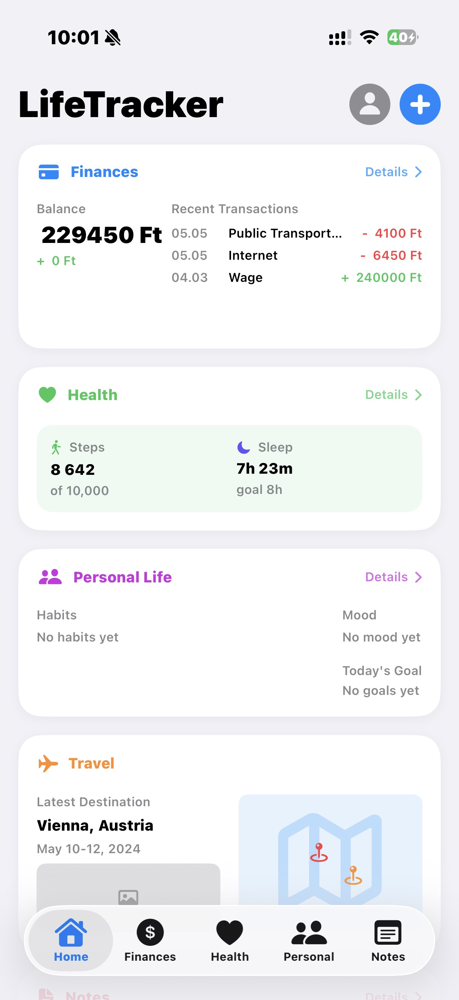

# LifeTracker

LifeTracker is a SwiftUI app for tracking finances, health, and personal goals.

## Features
- Track income, expenses, and budgets
- View HealthKit-based daily stats
- Build habits and log moods
- Capture notes and goals

## Requirements
- Xcode 15 or newer (SwiftData)
- iOS 17 or newer

## Getting started
1. Open the Xcode project: `LifeTracker.xcodeproj`.
2. Select the `LifeTracker` scheme.
3. Run on a simulator or device.

## HealthKit
The app reads HealthKit data locally to display your metrics. No data is sent off-device by default.

## Security
If you add third-party services, keep secrets out of the repo (for example, via an untracked `.xcconfig` file).

